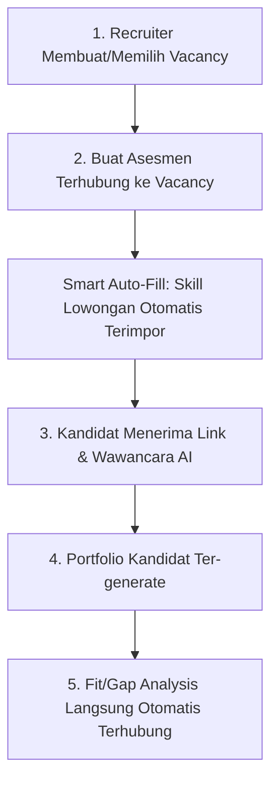

# Step 4: Revamp Strategy

## 1. Latar Belakang & Rationale Perubahan
Pada sistem awal (*baseline*), alur evaluasi berpusat pada kandidat (*candidate-centric*):
* Asesmen dibuat secara terisolasi tanpa konteks posisi pekerjaan tertentu.
* Setelah wawancara selesai dan portfolio terbuat, *recruiter* harus memilih lowongan secara manual satu per satu dari dropdown untuk menjalankan Fit/Gap Analysis.

Untuk meningkatkan efisiensi dan menyelaraskan dengan kebutuhan industri rekrutmen nyata, sistem ditransformasikan menjadi **Vacancy-Centric Flow** disertai **Revamp UI Modern**.

---

## 2. Perubahan Arsitektur & Database

### A. Skema Database & Relasi Model
1. **Migrasi Tabel `assessments`**:
   - Menambahkan kolom `vacancy_id` (tipe `BIGINT`, nullable, foreign key ke `vacancies.id`).
2. **Relasi Model (Rails)**:
   - `Assessment`: Menambahkan relasi `belongs_to :vacancy, optional: true`.
   - `Vacancy`: Menambahkan relasi `has_many :assessments, dependent: :nullify`.
3. **Controller & API**:
   - `AssessmentsController`: Mengizinkan parameter `:vacancy_id` dan menyertakan data lowongan (`vacancy: { id, role_title }`) pada response API.

---

## 3. Alur Kerja Baru (Vacancy-Centric UX)

1. **Pembuatan Asesmen Terarah**:
   - Recruiter memilih posisi lowongan target (*Target Vacancy*) di awal formulir.
   - **Smart Auto-Fill Skills**: Kebutuhan skill dan ekspektasi level dari lowongan otomatis terimpor ke dalam formulir asesmen. Recruiter tidak perlu lagi mengisi scope, kriteria include/exclude, atau anchor L1–L5 secara manual.
2. **Eliminasi Langkah Manual**:
   - Portfolio kandidat langsung membawa konteks lowongan target.
   - Recruiter tidak perlu memilih lowongan secara manual di halaman portfolio; analisis Fit/Gap langsung siap dijalankan dalam 1 klik.

---

## 4. Rencana Revamp UI (Modern Enterprise SaaS)

Pembaruan antarmuka mengadopsi standar modern *web application*:
* **Layout & Komponen**: Struktur berbasis kartu modular (*card-based layout*), *subtle border*, serta *elevation shadow* yang lembut.
* **Badges & Indikator Status**: Mengganti teks polos dengan badge modern ber-dot indikator (misal: *emerald* untuk match, *amber* untuk gap, dan *indigo* untuk tag lowongan).
* **Tipografi & Hirarki Visual**: Pengelompokan informasi metrik wawancara dan skill score yang lebih terstruktur dan nyaman dipindai (*scannable*).
* **Mikro-interaksi & Transisi**: Efek hover interaktif dan feedback animasi pada tombol aksi utama.
