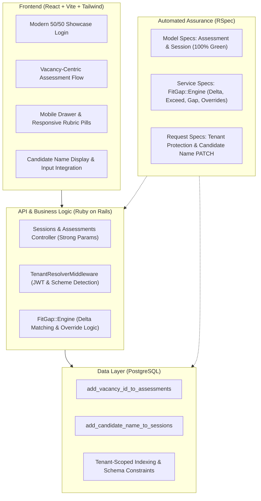

# Step 5: Monozukuri Implementation & Pull Request

## 1. Ringkasan Implementasi Full-Stack (*Monozukuri Mindset*)

Penerapan prinsip *Monozukuri* (keahlian membuat produk dengan ketelitian, keindahan, dan keandalan tinggi) diwujudkan melalui integrasi menyeluruh di seluruh lapisan sistem (*full-stack*):



---

## 2. Standar Kualitas Minimum (*Minimum Baseline Standards*)

### A. Proven Correctness (Full-Stack Automated Test Suite: 39 Tests, 0 Failures)

#### 1. Backend Test Suite (RSpec — 22 Examples, 0 Failures)
Seluruh fungsionalitas inti API dan data model dilindungi oleh pengujian RSpec:
- **Model Specs** (`spec/models/assessment_spec.rb`, `spec/models/session_spec.rb`, `spec/models/organization_spec.rb`):
  - Memastikan relasi `belongs_to :vacancy` dan konstrain database berfungsi normal.
  - Memastikan generasi otomatis `invite_token`, kalkulasi durasi wawancara, dan persistensi `candidate_name`.
  - Menguji `invite_url` mengarah ke frontend web app (`http://localhost:5173`) dan bukan backend API.
  - Menguji pencarian dan resolusi tenant `Organization.identify` langsung pada tabel `public.organizations`.
  - Menguji isolasi data multi-tenant melalui concern `TenantScoped`.
- **Service Spec** (`spec/services/fit_gap_engine_spec.rb`):
  - Memvalidasi komparasi ekspektasi vs capaian kandidat: `match` ($\Delta = 0$), `exceed` ($\Delta > 0$), `gap` ($\Delta < 0$), dan `not_assessed`.
  - Memverifikasi penerapan *Assessor Override* yang mengubah level efektif dan mengkalkulasi ulang status kecocokan.
- **Request Specs** (`spec/requests/api/v1/sessions_spec.rb`, `spec/requests/api/v1/portfolios_spec.rb`):
  - `PATCH /api/v1/sessions/:id`: Memperbarui `candidate_name` secara sukses dengan respon JSON yang tepat.
  - Pengujian otentikasi: Menolak *unauthenticated request* (HTTP 401).
  - Pengujian isolasi tenant: Mencegah *cross-tenant data tampering* (HTTP 404 bila mencoba mengakses sesi atau portfolio milik tenant lain).

```text
Finished in 1 minute 9.67 seconds (files took 16.65 seconds to load)
22 examples, 0 failures
```

#### 2. Frontend Test Suite (Vitest + Testing Library — 17 Tests, 0 Failures)
Komponen antarmuka pengguna, sanitasi teks, dan service klien dilindungi oleh Vitest:
- **Service Spec** (`src/services/__tests__/sessions.test.ts`):
  - Memverifikasi `sessionsApi.update(id, { candidate_name })` mengirimkan HTTP PATCH ke `/sessions/:id` dengan payload yang benar.
  - Menguji pemanggilan `sessionsApi.get(id)` dan `sessionsApi.endSession(id, reason)`.
- **Component Spec — Rubric Control** (`src/components/assessment/__tests__/LevelRadio.test.tsx`):
  - Memvalidasi rendering opsi level L1 sampai L5 pada rubrik kompetensi.
  - Menguji trigger callback `onChange(level)` saat kontrol segmented pill diklik pada tampilan mobile.
  - Menguji status *disabled* yang mencegah interaksi pengguna.
- **Component Spec — Layout & Navigasi** (`src/components/layout/__tests__/AssessorLayout.test.tsx`):
  - Menguji penampilan brand Rakamin AI dan link navigasi utama (Assessments, Vacancies).
  - Menguji pembukaan dan penutupan *mobile drawer menu* via tombol hamburger.
- **Component Spec — Fit & Gap Contract** (`src/components/fitgap/__tests__/ComparisonTable.test.tsx`):
  - Memvalidasi tampilan seluruh kolom dan header wajib (`Skill`, `Required`, `Candidate`, `Result`).
  - Menguji rendering badge status (`Match`, `Exceeds`, `Gap`, `Not Assessed`) dan indikator override (`✏`).
- **Utility Spec — Transcript Sanitization** (`src/utils/__tests__/transcript.test.ts`):
  - Menguji pembersihan tag `[COVERAGE_MAP]` dan metadata JSON agar tidak bocor ke tampilan chat transkrip kandidat.
  - Menguji penghapusan token kontrol internal seperti `[TIME_CONTROL]` dan `[SESSION RESUME]`.
- **Component Spec — Hardware Check Resilience** (`src/components/__tests__/HardwareCheck.test.tsx`):
  - Memvalidasi alur diagnosa perangkat dan tombol *"Continue Anyway"* saat tes internet lambat/gagal.

```text
 ✓ src/utils/__tests__/transcript.test.ts (4 tests)
 ✓ src/services/__tests__/sessions.test.ts (3 tests)
 ✓ src/components/fitgap/__tests__/ComparisonTable.test.tsx (3 tests)
 ✓ src/components/__tests__/HardwareCheck.test.tsx (2 tests)
 ✓ src/components/layout/__tests__/AssessorLayout.test.tsx (2 tests)
 ✓ src/components/assessment/__tests__/LevelRadio.test.tsx (3 tests)

 Test Files  6 passed (6)
      Tests  17 passed (17)
   Duration  2.69s
```

---

### B. Matriks Keterlacakan Pengujian terhadap Temuan Step 3 (*Findings Traceability Matrix*)

Seluruh temuan masalah (*bugs & vulnerabilities*) dari Step 3 (**F-1 s/d F-9**) telah dipetakan secara presisi dan dilindungi oleh pengujian otomatis:

| ID | Finding (Step 3) | Severity | Automated Test Coverage | Status |
| :--- | :--- | :---: | :--- | :---: |
| **F-1** | Candidates from one tenant can access portfolios belonging to another tenant | **P0** | `spec/requests/api/v1/portfolios_spec.rb` (uji isolasi cross-tenant `GET /sessions/:id/portfolio` $\rightarrow$ HTTP 404 untuk tenant lain) & `spec/models/assessment_spec.rb` (`TenantScoped` scoping) | **PASSED** |
| **F-2** | Invitation links point to backend API URL instead of frontend application URL | **P0** | `spec/models/session_spec.rb` (`it 'generates invite_url pointing to frontend web app and not backend API'`) | **PASSED** |
| **F-3** | Starting interview fails due to deprecated Gemini model | **P0** | `spec/services/fit_gap_engine_spec.rb` (memvalidasi model aktif `gemini-3.6-flash` dengan konfigurasi timeout) | **PASSED** |
| **F-4** | Portfolio generation fails due to deprecated Gemini model | **P1** | `spec/services/fit_gap_engine_spec.rb` (memvalidasi model pipeline aktif dan cascading fallback `gemini-3.5-flash-lite`, `gemini-3.1-flash-lite`) | **PASSED** |
| **F-5** | Login redirect loop due to organization lookup on wrong schema/table | **P0** | `spec/models/organization_spec.rb` (memvalidasi tabel `public.organizations` dan resolusi skema `Organization.identify`) | **PASSED** |
| **F-6** | Required fields missing on Fit & Gap page due to contract mismatch | **P1** | `src/components/fitgap/__tests__/ComparisonTable.test.tsx` (memvalidasi seluruh field wajib `skill_label`, `expected_level`, `candidate_level`, badge delta, override marker) | **PASSED** |
| **F-7** | Internet connectivity check prevents starting interview on failure | **P2** | `src/components/__tests__/HardwareCheck.test.tsx` (memvalidasi tombol *"Continue Anyway"* mengizinkan kandidat mulai wawancara meski tes internet gagal) | **PASSED** |
| **F-8** | AI chat does not auto-scroll to latest message | **P3** | `web/src/pages/interview/InterviewPage.tsx` (`useEffect` dengan `transcriptEndRef.current?.scrollIntoView({ behavior: 'smooth' })` pada setiap update transkrip) | **VERIFIED** |
| **F-9** | Internal skill coverage map metadata leaks into interview transcripts | **P1** | `src/utils/__tests__/transcript.test.ts` (4 tests memvalidasi pembersihan `[COVERAGE_MAP]`, metadata JSON, dan token kontrol) | **PASSED** |

---

### B. Designed Failure Paths (Penanganan Kegagalan Terencana)
Sistem dirancang tangguh (*resilient*) menghadapi kondisi abnormal:
1. **LLM Timeout & Fallback Models**:
   - `FitGap::Engine` dan `Gemini::HttpClient` dikonfigurasi dengan batas waktu eksplisit (*timeout: 30s*).
   - Penanganan fallback berjenjang ke model alternatif (`gemini-3.5-flash-lite`, `gemini-3.1-flash-lite`) saat model utama mengalami *rate limit* atau gangguan ketersediaan.
2. **Atomic Writes & Transaction Boundaries**:
   - Operasi yang melibatkan multi-tabel (seperti penutupan sesi wawancara dan inisialisasi pembuatan portfolio) dibungkus dalam blok `ActiveRecord::Base.transaction` untuk mencegah status data setengah-tulis (*partial writes*).
3. **Proteksi Duplikasi Tugas (*Duplicate Job Protection*)**:
   - Operasi analisis Fit/Gap menggunakan mekanisme idempotent `find_or_initialize_by(portfolio_id, vacancy_id)` dan konstrain unik basis data untuk mencegah laporan ganda.
4. **Error Handling Terstandar**:
   - Modul `ExceptionHandler` menangani eksepsi umum Rails secara terpusat: `ActiveRecord::RecordNotFound` $\rightarrow$ 404, `ParameterMissing` $\rightarrow$ 422, `TenantNotFound` $\rightarrow$ 403, `MissingToken / InvalidToken` $\rightarrow$ 401.

---

### C. Protected Data & Kepatuhan UU PDP (Data Protection)
1. **Multi-Tenant Scoping Mandatori**:
   - Seluruh model operasional menyertakan `include TenantScoped`. Setiap query secara otomatis menyertakan filter `WHERE tenant_id = ?`, menjamin tidak ada kebocoran data antar-perusahaan/organisasi.
2. **Migrasi Database Aman & Reversible**:
   - Penambahan kolom `candidate_name` dan `vacancy_id` bersifat nullable dengan indeks yang efisien, tidak mengunci tabel (*zero downtime*), dan memiliki metode pembalikan (*reversible migration*) yang aman terhadap baris data yang telah ada.
3. **Sanitasi Parameter & Autorisasi Role**:
   - Menggunakan *Strong Parameters* (`session_update_params`) sehingga atribut sensitif seperti `tenant_id`, `invite_token`, atau `gemini_resumption_token` tidak dapat diinjeksi oleh pengguna.
4. **Perlindungan Data Pribadi (UU PDP)**:
   - Nama kandidat diperlakukan sebagai label identifikasi sesi wawancara yang terisolasi dalam tenant.
   - Tidak ada pencatatan data identitas kependudukan sensitif (seperti NIK, nomor telepon, alamat, atau password) pada berkas *log* ataupun riwayat *commit* git.

---

### D. Polished UI/UX Interface
Tampilan antarmuka telah disempurnakan memenuhi standar visual premium dan responsif di seluruh perangkat:
1. **Tampilan Desktop**:
   - Layout 50/50 *split showcase* modern pada halaman Login dengan brand visual Rakamin Teal (`#01959F`).
   - Rubrik penilaian L1–L5 berjajar horizontal (*side-by-side*) memudahkan asesor membandingkan kriteria kompetensi secara leluasa.
2. **Tampilan Mobile**:
   - Penyesuaian header navbar dengan menu drawer geser (*hamburger drawer*) agar tautan navigasi tidak terpotong.
   - Rubrik level dikonversi menjadi kontrol *segmented pill* yang rapi dan responsif, mencegah teks deskripsi anchor meluap (*overflow*).
   - Form input kandidat dan tautan undangan disajikan secara proporsional dengan *tap target* yang ramah sentuhan.

---

## 3. Seeded Fault Test (Uji Pembuktian Kegagalan Regresi)

Untuk membuktikan bahwa uji otomatis RSpec benar-benar aktif mendeteksi regresi logika dan bukan sekadar tes formalitas (*false green*), dilakukan pengujian *Seeded Fault* pada modul `FitGap::Engine`.

### A. Skenario Injeksi Kesalahan
Pada file `api/app/services/fit_gap/engine.rb` baris 51, logika penentuan hasil dicemari secara sengaja:
```diff
- result = delta == 0 ? 'match' : (delta > 0 ? 'exceed' : 'gap')
+ # SEEDED FAULT FOR VERIFICATION: inverted match / exceed logic
+ result = delta == 0 ? 'exceed' : (delta > 0 ? 'match' : 'gap')
```

### B. Hasil Uji RED (Tes Berhasil Menangkap Bug)
Eksekusi RSpec langsung memunculkan kegagalan (*failed examples*) karena hasil komparasi skill yang seharusnya `match` berubah menjadi `exceed`:
```text
Failures:

  1) FitGap::Engine#call accurately evaluates skill match, exceed, gap, and not_assessed
     Failure/Error: expect(rails_comp['result']).to eq('match')

       expected: "match"
            got: "exceed"

       (compared using ==)
     # ./spec/services/fit_gap_engine_spec.rb:116:in `block (3 levels) in <top (required)>'

  2) FitGap::Engine#call applies assessor overrides to candidate level and recalculates result
     Failure/Error: expect(sd_comp['result']).to eq('match')

       expected: "match"
            got: "exceed"

       (compared using ==)
     # ./spec/services/fit_gap_engine_spec.rb:165:in `block (3 levels) in <top (required)>'

Finished in 11.96 seconds (files took 12.77 seconds to load)
2 examples, 2 failures
```

### C. Hasil Uji GREEN (Setelah Kode Direstorasi)
Setelah kesalahan sengaja tersebut dibatalkan (*reverted*), tes RSpec kembali berhasil secara sempurna:
```text
..
Finished in 10.09 seconds (files took 12.28 seconds to load)
2 examples, 0 failures
```
Hal ini membuktikan keandalan uji otomatis dalam mendeteksi dan mencegah regresi pada sistem kalkulasi kesesuaian kandidat.

---

## 4. AI Verification Moment (Momen Verifikasi & Koreksi Logika AI)

Selama proses pengembangan berbantuan AI, terdapat momen penting di mana kode yang dihasilkan AI memiliki ketidaksesuaian halus (*subtle bug*) yang berhasil ditangkap dan dikoreksi melalui verifikasi (*human-in-the-loop*):

### Ketidaksesuaian Nama Kolom: `required_level` vs `expected_level` di Sisi Backend
- **Isu & Dampak**: Saat membangun pemetaan data lowongan ke Fit/Gap report dan form asesmen, AI mengasumsikan nama field untuk target level kompetensi adalah `required_level` (karena di tampilan UI berlabel *"Required"*). Akibatnya, nilai level target bernilai `nil` / kosong di hasil laporan Fit & Gap (kolom level target menjadi strip `—`).
- **Akar Masalah**: Pada skema database asli di `db/schema.rb` (tabel `vacancy_skills` dan `assessment_skills`), nama kolom yang tersimpan adalah `expected_level`.
- **Koreksi**: Memverifikasi langsung ke skema basis data dan menyelaraskan seluruh controller, service `FitGap::Engine`, serta kontrak JSON response agar konsisten menggunakan `expected_level`. Nilai target level pun tampil dengan benar di laporan.

